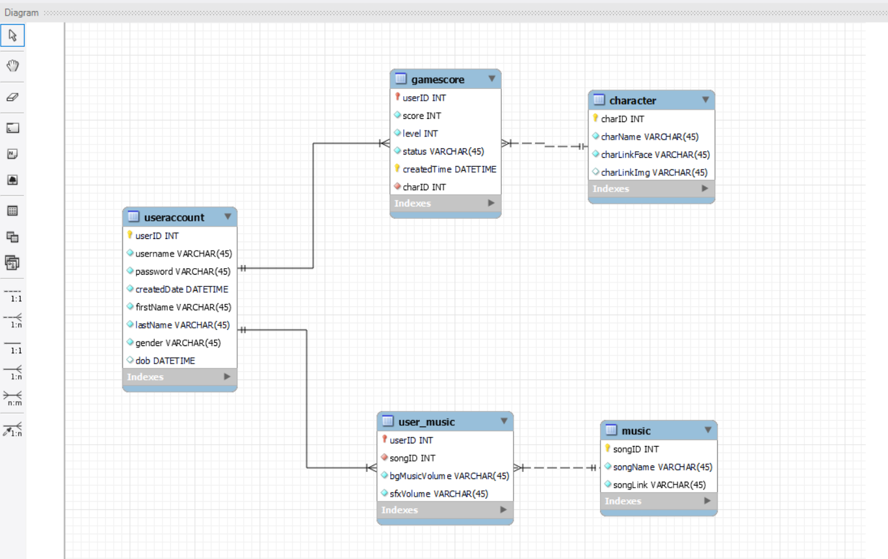

# Bomberman 
A bomberman game for OOP and DBMS class.
## Video Demo
### Video Demo Player mode

### Video Demo Admin mode

## Technology 
- UI: JavaFX + SceneBuilder
- Database: SQLite

## GamePlay
- Bomber: Arrow keys to move, Space to place bomb
- Enemy:
    - Easy: Moves in a predefined direction
    - Medium: Follows bomber, cannot avoid bombs
    - Hard: Follows bomber, can avoid bombs
- Items:
    - Speed: Doubles speed
    - Bomb: +1 bomb
    - Bomb Size: +1 bomb radius
    - Point Up: +2000 points
    - Key: Opens door
    - Door: Moves to next map
- Scoring:
    - Collect Item: +300 points
    - Kill Enemy: +500 points
    - Break Brick: +100 points
    - Level Up: +500 points

## Features
- User Accounts: Sign up, login, logout; stores personal info, settings, and scores
- Music Settings: Customize and save background music and volume
- History: View past scores, times, characters; highest score; favorite character
- Ranking: View top 3 overall and daily rankings
- Admin Mode:
    - Admin account (username: admin, password: 321)
    - View, search, and delete user accounts
    - View user game histories

## DATABASE
- SQLite
- SQL queries in "src/main/java/bomberman/Model"

### EER Diagram
  

Updated: 22/10/2022

